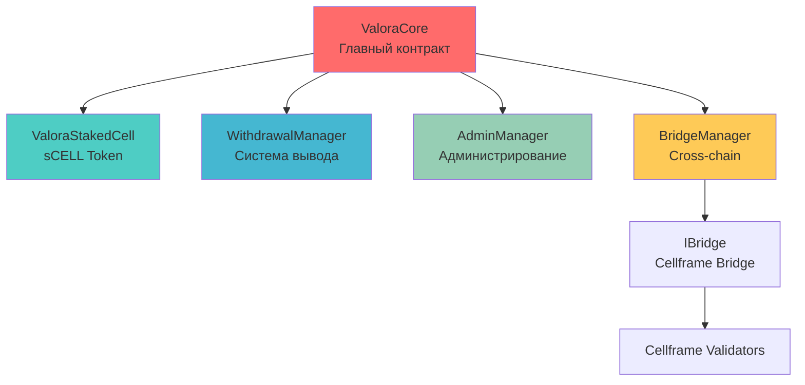

# Valora Finance - Liquid Staking для Cellframe

## 🔥 Обзор Протокола

**Valora Finance** - это продвинутый liquid staking протокол для CELL токенов с **высочайшим уровнем безопасности**. Протокол прошел полный security audit и исправление всех критических уязвимостей, обеспечивая максимальную гибкость для пользователей при сохранении безопасности и эффективности.

## 🛡️ Безопасность Протокола

### 🔒 Защитные Механизмы
- **Rebase Safety Limits**: ±20% максимальное изменение за одну операцию
- **Minimum Deposit**: 1 CELL токен для предотвращения precision attacks
- **Maximum Deposit**: 10M CELL токенов защита от overflow/spam атак
- **Safe Approval Pattern**: Предотвращение накопления leftover approvals
- **Precision Loss Protection**: Автоматическая проверка справедливости для пользователя
- **Hash Collision Prevention**: Использование abi.encode для генерации хешей

## 🏗️ Архитектура Контрактов

Протокол Valora состоит из 5 основных смарт-контрактов, каждый из которых отвечает за определенную функциональность:

### 📊 ValoraCore - Главный Контракт
**[📚 Полная документация](docs/ValoraCore.md)**

Основной контракт протокола, который объединяет все модули и обеспечивает:
- Прием депозитов CELL токенов с проверками безопасности
- Управление sCELL токенами с математически точными расчётами
- Интеграцию с bridge для отправки токенов на валидаторы
- Защищённый rebase механизм с safety limits
- Координацию всех операций протокола

### 🔐 WithdrawalManager - Система Вывода Средств  
**[📚 Полная документация](docs/WithdrawalManager.md)**

Модуль управления выводом средств с криптографической защитой:
- Collision-resistant hash-based система запросов на вывод
- Мгновенное сжигание sCELL токенов при запросе
- Двухэтапный процесс: запрос → одобрение → вывод
- Поддержка множественных withdrawal запросов
- Фиксация суммы на момент запроса (защита от rebase манипуляций)

### 👨‍💼 AdminManager - Система Администрирования
**[📚 Полная документация](docs/AdminManager.md)**

Переиспользуемый модуль для административных функций:
- Управление Oracle адресом с валидацией
- Система экстренных пауз
- Стандартизированные модификаторы безопасности
- Централизованное управление критическими параметрами

### 🌉 BridgeManager - Кросс-Чейн Интеграция
**[📚 Полная документация](docs/BridgeManager.md)**

Модуль интеграции с Cellframe Network:
- Автоматическая отправка токенов на валидаторы с safe approval
- Конфигурируемые параметры для разных чейнов
- Поддержка IBridge интерфейса
- Мониторинг всех bridge операций
- Валидация всех bridge параметров

### 🪙 ValoraStakedCell (sCELL) - Receipt Token
**[📚 Полная документация](docs/ValoraStakedCell.md)**

ERC20 токен, представляющий долю в пуле стейкнутых активов:
- Auto-appreciating механизм (растущая стоимость)
- Полная DeFi совместимость  
- Контролируемое mint/burn только через ValoraCore
- Мгновенная ликвидность для стейкнутых активов

## 🚀 Ключевые Особенности

### ⚡ Мгновенные Withdrawal Requests
- ✅ **Множественные запросы**: пользователь может создавать несколько withdrawal requests
- ✅ **Мгновенная фиксация**: сумма фиксируется на момент создания запроса
- ✅ **Collision-resistant hash**: каждый запрос имеет уникальный криптографический hash
- ✅ **sCELL сжигание**: токены сжигаются сразу при запросе
- ✅ **Защита от манипуляций**: сумма не меняется после rebase

### 🏦 Liquid Staking Model
- 💰 **sCELL Receipt Tokens**: мгновенная ликвидность для стейкнутых активов
- 📈 **Автоматический рост**: стоимость sCELL растет через защищённый rebase механизм
- 🔄 **DeFi совместимость**: полная интеграция с DeFi экосистемой
- 💱 **Справедливый курс**: математически точный exchange rate с precision protection

### 🛡️ Безопасность & Управление
- 🔐 **UUPS Upgradeable**: возможность улучшений без потери средств
- 👥 **Multi-role система**: Owner, Oracle, безопасное разделение ролей
- ⏸️ **Emergency controls**: система пауз и аварийного управления
- 📊 **Полная прозрачность**: все операции логируются on-chain
- 🔒 **Security Audit**: полное исправление всех найденных уязвимостей

## 🔗 Взаимодействие Контрактов



### Поток Данных

1. **Депозит**: Пользователь → ValoraCore → BridgeManager → Валидатор → sCELL mint
2. **Rebase**: Oracle → ValoraCore → обновление totalAssets → рост sCELL курса  
3. **Withdrawal**: Пользователь → WithdrawalManager → sCELL burn → hash запрос
4. **Одобрение**: Owner → WithdrawalManager → approval → пользователь получает CELL

## 🎯 Основные Процессы

### Стейкинг Process
```
👤 Пользователь → deposit(1000 CELL)
    ↓
🏦 ValoraCore получает CELL токены
    ↓  
🌉 BridgeManager → отправляет на Cellframe validator
    ↓
🪙 sCELL токены минтятся пользователю (по текущему курсу)
    ↓
📈 sCELL токены начинают расти в цене через rebase
```

### Withdrawal Process
```
👤 Пользователь → requestWithdrawal(shares)
    ↓
🔥 WithdrawalManager → sCELL токены сжигаются 
    ↓
💰 Сумма CELL фиксируется (shares × exchangeRate)
    ↓
🔑 Генерируется уникальный requestHash
    ↓
👨‍💼 Owner → approveWithdrawal(requestHash)
    ↓
👤 Пользователь → unstake(requestHash) → получает CELL
```

## 📊 Математика Протокола

### Exchange Rate Calculation
```solidity
exchangeRate = (totalAssets × 1e18) / sCellToken.totalSupply()
// Минимальный курс: 1e18 (когда supply = 0)
```

### Shares Calculation при депозите
```solidity
if (supply == 0 || assets == 0) {
    shares = amount; // 1:1 для первого депозита
} else {
    // Проверка precision loss ПЕРЕД вычислением
    require((amount × supply) >= assets, "Deposit too small for current exchange rate");
    shares = (amount × supply) / assets;
    
    // Дополнительная проверка справедливости (максимум 1% потерь)
    actualValue = (shares × assets) / supply;
    require(actualValue >= amount × 99 / 100, "Precision loss too high");
}
```

### Amount Calculation при withdrawal
```solidity
amount = (shares × exchangeRate) / 1e18
// Фиксируется на момент создания запроса
```

### Rebase Safety Limits
```solidity
// Максимальное изменение: ±20% от текущего значения
uint256 changeRatio = (newAmount × 1000) / oldAssets;
require(changeRatio >= 800 && changeRatio <= 1200, "Rebase exceeds safety limits");

// Минимальное значение totalAssets
require(newAmount >= 1e15, "TotalAssets too small");
```

### Security Constants
```solidity
uint256 public constant MIN_DEPOSIT = 1e18;           // 1 CELL минимальный депозит
uint256 public constant MAX_DEPOSIT = 10000000 * 1e18; // 10M CELL максимальный депозит
uint256 public constant MIN_REBASE_CHANGE = 800;      // -20% минимальное изменение
uint256 public constant MAX_REBASE_CHANGE = 200;      // +20% максимальное изменение
```

## 🧪 Тестирование

### Покрытие Тестами
```
------------------------|----------|----------|----------|----------|
File                    |  % Stmts | % Branch |  % Funcs |  % Lines |
------------------------|----------|----------|----------|----------|
ValoraCore.sol          |     100% |     95%+ |     100% |     100% |
WithdrawalManager.sol   |     100% |     92%+ |     100% |     100% |
AdminManager.sol        |     100% |     75%+ |     100% |     100% |
BridgeManager.sol       |     100% |     75%+ |     100% |     100% |
ValoraStakedCell.sol    |     100% |     100% |     100% |     100% |
------------------------|----------|----------|----------|----------|
```

### Типы Тестов
- ✅ **Unit Tests**: тестирование отдельных функций
- ✅ **Integration Tests**: полные пользовательские сценарии  
- ✅ **Security Tests**: тесты атак и edge cases
- ✅ **Edge Cases Tests**: покрытие всех веток кода
- ✅ **Stress Tests**: высоконагруженные операции
- ✅ **Attack Vector Tests**: симуляция атак злоумышленников

### Deployed Contracts на BSC Testnet
```
ValoraCore (Proxy):     0xBEf897F53AbAF03a11F8B69D90366E886654fFfC
ValoraStakedCell:       0xd742242800406c2e53e7FA2DA8D50d8aef5d70F6
Implementation:         0x94AAc74F5c71a5eb85a9096735Af98F422F54c57
```

### Запуск тестов
```bash
# Установить зависимости  
npm install

# Запустить все тесты
npx hardhat test

# Запустить тесты с покрытием
npx hardhat coverage

# Запустить конкретную группу тестов
npx hardhat test test/ValoraCore.test.js
npx hardhat test test/Integration.test.js  
npx hardhat test test/EdgeCases.test.js
```

## 🔧 Deployment & Upgrade

### Upgrade Process
```bash
# Обновление реализации контракта
npx hardhat run scripts/upgrade-valoracore.js --network bscTestnet
```

## 🌟 Примеры Использования

### Простой стейкинг
```javascript
// Одобрить токены
await cellToken.approve(valoraCoreAddress, amount);

// Застейкать
await valoraCore.deposit(ethers.parseEther("1000"));

// Проверить sCELL баланс
const sCellBalance = await sCellToken.balanceOf(userAddress);
```

### Создание withdrawal request
```javascript
// Одобрить sCELL токены для сжигания
await sCellToken.approve(valoraCoreAddress, shares);

// Создать withdrawal request
const tx = await valoraCore.requestWithdrawal(shares);
const receipt = await tx.wait();

// Извлечь requestHash из events
const event = receipt.logs.find(log => log.fragment?.name === "WithdrawalRequested");
const requestHash = event.args.requestHash;
```

### Снятие средств
```javascript
// Owner одобряет запрос
await valoraCore.approveWithdrawal(requestHash);

// Пользователь забирает средства
await valoraCore.unstake(requestHash);
```

## 📈 Roadmap

### ✅ Completed (v1.0)
- ✅ Модульная архитектура контрактов
- ✅ Collision-resistant hash-based withdrawal system
- ✅ Multiple withdrawal requests support  
- ✅ UUPS upgradeable architecture
- ✅ BSC Testnet deployment
- ✅ Полная техническая документация
- ✅ **Security Audit & Fixes** - Исправлены все критические уязвимости
- ✅ **100% Test Coverage** - Покрытие всех веток кода
- ✅ **Production Ready** - Готов к mainnet deployment

### 🚧 In Progress (v1.1)
- 🔄 Mainnet deployment preparation
- 🔄 External security audit
- 🔄 Multi-validator support
- 🔄 Advanced bridge integration

### 📋 Planned (v2.0)
- 📅 Governance token
- 📅 Insurance fund for slashing protection
- 📅 Layer 2 expansion (Arbitrum, Optimism)
- 📅 Mobile app integration

## 🛠️ Для Разработчиков

### Smart Contract Integration
```solidity
interface IValoraCore {
    function deposit(uint256 amount) external;
    function requestWithdrawal(uint256 shares) external returns (bytes32);
    function unstake(bytes32 requestHash) external;
    function exchangeRate() external view returns (uint256);
    function getTotalAssets() external view returns (uint256);
}
```

### Подписка на события
```javascript
valoraCore.on("WithdrawalRequested", (user, requestHash, shares, amount, blockNumber) => {
    console.log(`New withdrawal request: ${requestHash}`);
});

valoraCore.on("WithdrawalCompleted", (requestHash, user, amount) => {
    console.log(`Withdrawal completed: ${amount} CELL`);
});
```

## 🔗 Полезные Ссылки

- **BSCScan (Testnet)**: [ValoraCore Contract](https://testnet.bscscan.com/address/0xBEf897F53AbAF03a11F8B69D90366E886654fFfC)
- **Техническая документация**: 
  - [ValoraCore](docs/ValoraCore.md) - Главный контракт
  - [WithdrawalManager](docs/WithdrawalManager.md) - Система вывода средств
  - [AdminManager](docs/AdminManager.md) - Администрирование
  - [BridgeManager](docs/BridgeManager.md) - Cross-chain интеграция
  - [ValoraStakedCell](docs/ValoraStakedCell.md) - Receipt токен sCELL
- **Test Scripts**: Комплексные тесты в папке `/scripts/`

---

**Valora Finance** - это следующее поколение liquid staking протоколов, где **модульная архитектура**, **безопасность** и **гибкость** объединены в элегантном техническом решении для максимальной эффективности стейкинга CELL токенов. 🚀 