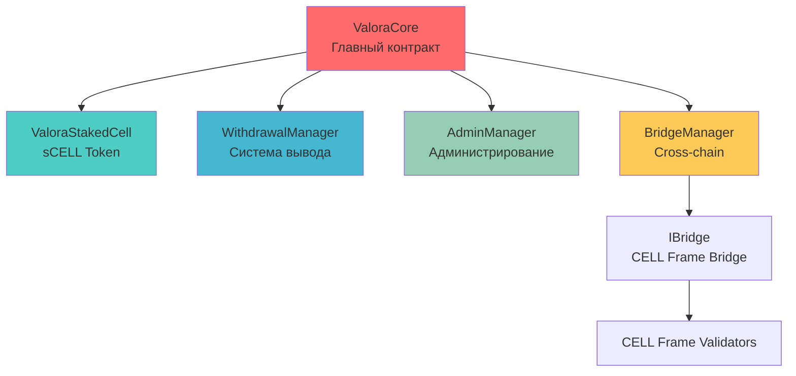

# Valora Finance - Liquid Staking для CELL Frame

## 🔥 Обзор Протокола

**Valora Finance** - это продвинутый liquid staking протокол для CELL токенов с **мгновенными withdrawal requests** и **hash-based системой снятия**. Протокол обеспечивает максимальную гибкость для пользователей при сохранении безопасности и эффективности.

## 🏗️ Архитектура Контрактов

Протокол Valora состоит из 5 основных смарт-контрактов, каждый из которых отвечает за определенную функциональность:

### 📊 ValoraCore - Главный Контракт
**[📚 Полная документация](docs/ValoraCore.md)**

Основной контракт протокола, который объединяет все модули и обеспечивает:
- Прием депозитов CELL токенов
- Управление sCELL токенами  
- Интеграцию с bridge для отправки токенов на валидаторы
- Rebase механизм для обновления курса
- Координацию всех операций протокола

### 🔐 WithdrawalManager - Система Вывода Средств  
**[📚 Полная документация](docs/WithdrawalManager.md)**

Модуль управления выводом средств с криптографической защитой:
- Hash-based система запросов на вывод
- Мгновенное сжигание sCELL токенов при запросе
- Двухэтапный процесс: запрос → одобрение → вывод
- Поддержка множественных withdrawal запросов

### 👨‍💼 AdminManager - Система Администрирования
**[📚 Полная документация](docs/AdminManager.md)**

Переиспользуемый модуль для административных функций:
- Управление Oracle адресом
- Система экстренных пауз
- Стандартизированные модификаторы безопасности
- Централизованное управление критическими параметрами

### 🌉 BridgeManager - Кросс-Чейн Интеграция
**[📚 Полная документация](docs/BridgeManager.md)**

Модуль интеграции с CELL Frame Network:
- Автоматическая отправка токенов на валидаторы
- Конфигурируемые параметры для разных чейнов
- Поддержка IBridge интерфейса
- Мониторинг всех bridge операций

### 🪙 ValoraStakedCell (sCELL) - Receipt Token
**[📚 Полная документация](docs/ValoraStakedCell.md)**

ERC20 токен, представляющий долю в пуле стейкнутых активов:
- Auto-appreciating механизм (растущая стоимость)
- Полная DeFi совместимость  
- Контролируемое mint/burn только через ValoraCore
- Мгновенная ликвидность для стейкнутых активов

## 🚀 Ключевые Особенности

### ⚡ Мгновенные Withdrawal Requests
- ✅ **Множественные запросы**: пользователь может создавать несколько withdrawal requests
- ✅ **Мгновенная фиксация**: сумма фиксируется на момент создания запроса
- ✅ **Hash-based система**: каждый запрос имеет уникальный криптографический hash
- ✅ **sCELL сжигание**: токены сжигаются сразу при запросе

### 🏦 Liquid Staking Model
- 💰 **sCELL Receipt Tokens**: мгновенная ликвидность для стейкнутых активов
- 📈 **Автоматический рост**: стоимость sCELL растет через rebase механизм
- 🔄 **DeFi совместимость**: полная интеграция с DeFi экосистемой
- 💱 **Справедливый курс**: математически точный exchange rate

### 🛡️ Безопасность & Управление
- 🔐 **UUPS Upgradeable**: возможность улучшений без потери средств
- 👥 **Multi-role система**: Owner, Oracle, безопасное разделение ролей
- ⏸️ **Emergency controls**: система пауз и аварийного управления
- 📊 **Полная прозрачность**: все операции логируются on-chain

## 🔗 Взаимодействие Контрактов



### Поток Данных

1. **Депозит**: Пользователь → ValoraCore → BridgeManager → Валидатор → sCELL mint
2. **Rebase**: Oracle → ValoraCore → обновление totalAssets → рост sCELL курса  
3. **Withdrawal**: Пользователь → WithdrawalManager → sCELL burn → hash запрос
4. **Одобрение**: Owner → WithdrawalManager → approval → пользователь получает CELL

## 🎯 Основные Процессы

### Стейкинг Process
```
👤 Пользователь → deposit(1000 CELL)
    ↓
🏦 ValoraCore получает CELL токены
    ↓  
🌉 BridgeManager → отправляет на CELL Frame validator
    ↓
🪙 sCELL токены минтятся пользователю (по текущему курсу)
    ↓
📈 sCELL токены начинают расти в цене через rebase
```

### Withdrawal Process
```
👤 Пользователь → requestWithdrawal(shares)
    ↓
🔥 WithdrawalManager → sCELL токены сжигаются НЕМЕДЛЕННО
    ↓
💰 Сумма CELL фиксируется (shares × exchangeRate)
    ↓
🔑 Генерируется уникальный requestHash
    ↓
👨‍💼 Owner → approveWithdrawal(requestHash)
    ↓
👤 Пользователь → unstake(requestHash) → получает CELL
```

## 📊 Математика Протокола

### Exchange Rate Calculation
```solidity
exchangeRate = (totalAssets × 1e18) / sCellToken.totalSupply()
```

### Shares Calculation при депозите
```solidity
shares = (depositAmount × totalSupply) / totalAssets
```

### Amount Calculation при withdrawal
```solidity
amount = (shares × exchangeRate) / 1e18
```

### Rebase Effect
```
Rebase увеличивает totalAssets → растет exchangeRate → sCELL дорожают
```

## 🧪 Тестирование

### Deployed Contracts на BSC Testnet
```
ValoraCore (Proxy):     0xBEf897F53AbAF03a11F8B69D90366E886654fFfC
ValoraStakedCell:       0xd742242800406c2e53e7FA2DA8D50d8aef5d70F6
Implementation:         0x94AAc74F5c71a5eb85a9096735Af98F422F54c57
```

### Запуск тестов на BSC Testnet
```bash
# Клонировать репозиторий
git clone [repository-url]
cd restaking

# Установить зависимости  
npm install

# Настроить .env файл
echo "PRIVATE_KEY=your_private_key" > .env

# Запустить полный тест-flow
npx hardhat run scripts/test-flow.js --network bscTestnet
```

## 🔧 Deployment & Upgrade

### Upgrade Process
```bash
# Обновление реализации контракта
npx hardhat run scripts/upgrade-valoracore.js --network bscTestnet
```

## 🌟 Примеры Использования

### Простой стейкинг
```javascript
// Одобрить токены
await cellToken.approve(valoraCoreAddress, amount);

// Застейкать
await valoraCore.deposit(ethers.parseEther("1000"));

// Проверить sCELL баланс
const sCellBalance = await sCellToken.balanceOf(userAddress);
```

### Создание withdrawal request
```javascript
// Одобрить sCELL токены для сжигания
await sCellToken.approve(valoraCoreAddress, shares);

// Создать withdrawal request
const tx = await valoraCore.requestWithdrawal(shares);
const receipt = await tx.wait();

// Извлечь requestHash из events
const event = receipt.logs.find(log => log.fragment?.name === "WithdrawalRequested");
const requestHash = event.args.requestHash;
```

### Снятие средств
```javascript
// Owner одобряет запрос
await valoraCore.approveWithdrawal(requestHash);

// Пользователь забирает средства
await valoraCore.unstake(requestHash);
```

## 📈 Roadmap

### ✅ Completed (v1.0)
- ✅ Модульная архитектура контрактов
- ✅ Hash-based withdrawal system
- ✅ Multiple withdrawal requests support  
- ✅ UUPS upgradeable architecture
- ✅ BSC Testnet deployment
- ✅ Полная техническая документация

### 🚧 In Progress (v1.1)
- 🔄 Mainnet deployment preparation
- 🔄 Multi-validator support
- 🔄 Advanced bridge integration
- 🔄 Security audit

### 📋 Planned (v2.0)
- 📅 Governance token
- 📅 Insurance fund for slashing protection
- 📅 Layer 2 expansion (Arbitrum, Optimism)
- 📅 Mobile app integration

## 🛠️ Для Разработчиков

### Smart Contract Integration
```solidity
interface IValoraCore {
    function deposit(uint256 amount) external;
    function requestWithdrawal(uint256 shares) external returns (bytes32);
    function unstake(bytes32 requestHash) external;
    function exchangeRate() external view returns (uint256);
    function getTotalAssets() external view returns (uint256);
}
```

### Подписка на события
```javascript
valoraCore.on("WithdrawalRequested", (user, requestHash, shares, amount, blockNumber) => {
    console.log(`New withdrawal request: ${requestHash}`);
});

valoraCore.on("WithdrawalCompleted", (requestHash, user, amount) => {
    console.log(`Withdrawal completed: ${amount} CELL`);
});
```

## 🔗 Полезные Ссылки

- **BSCScan (Testnet)**: [ValoraCore Contract](https://testnet.bscscan.com/address/0xBEf897F53AbAF03a11F8B69D90366E886654fFfC)
- **Техническая документация**: 
  - [ValoraCore](docs/ValoraCore.md) - Главный контракт
  - [WithdrawalManager](docs/WithdrawalManager.md) - Система вывода средств
  - [AdminManager](docs/AdminManager.md) - Администрирование
  - [BridgeManager](docs/BridgeManager.md) - Cross-chain интеграция
  - [ValoraStakedCell](docs/ValoraStakedCell.md) - Receipt токен sCELL
- **Test Scripts**: Комплексные тесты в папке `/scripts/`

---

**Valora Finance** - это следующее поколение liquid staking протоколов, где **модульная архитектура**, **безопасность** и **гибкость** объединены в элегантном техническом решении для максимальной эффективности стейкинга CELL токенов. 🚀 